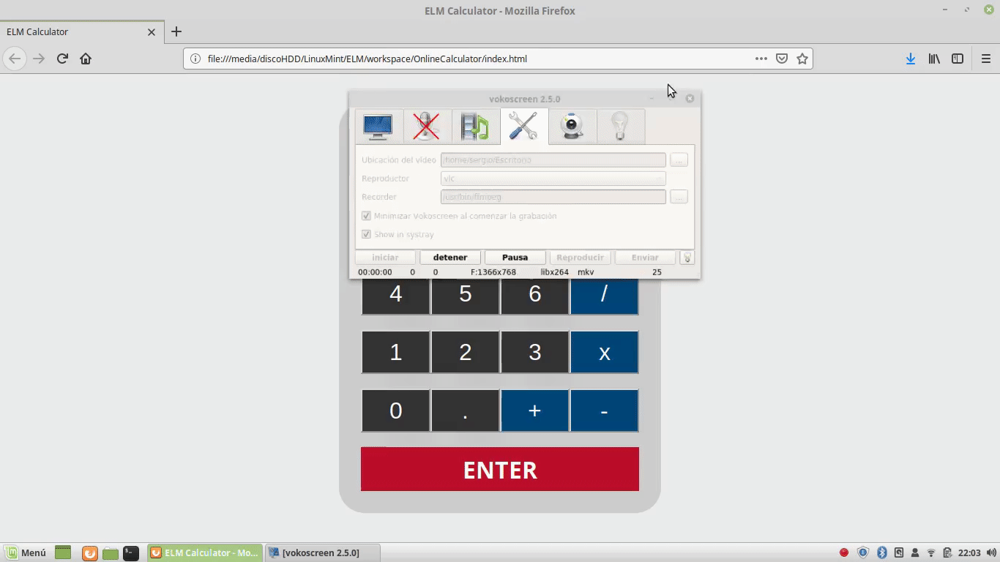

# Online Calculator
> Aplicación que simula el funcionamiento de una simple calculadora. 
> Desarrollo realizado empleando la programación funcional de ELM y hojas de estilo CSS. Puede probarse en:
https://serglezv.neocities.org/ELM-Calculator/index.html

## Herramientas utilizadas
- Lenguaje de programación funcional ELM (v.0.18.0)
- Hojas de estilo CSS
- Visual Studio Code

---

## Ejecución

1. Compilación: `make run`
1. Abrir archivo `index.html` con un navegador`
